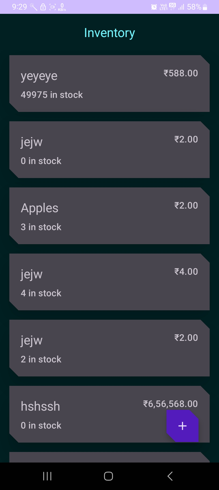
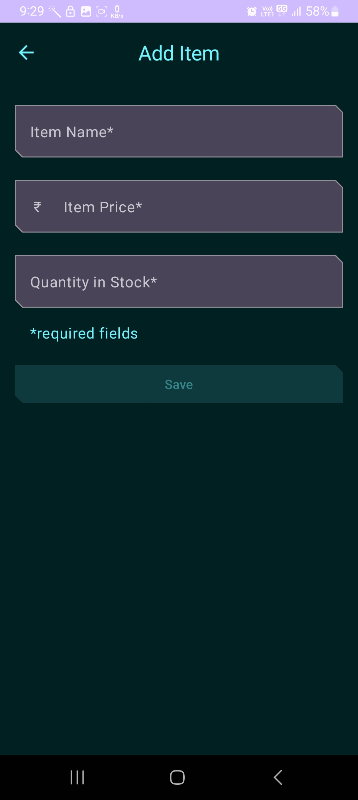
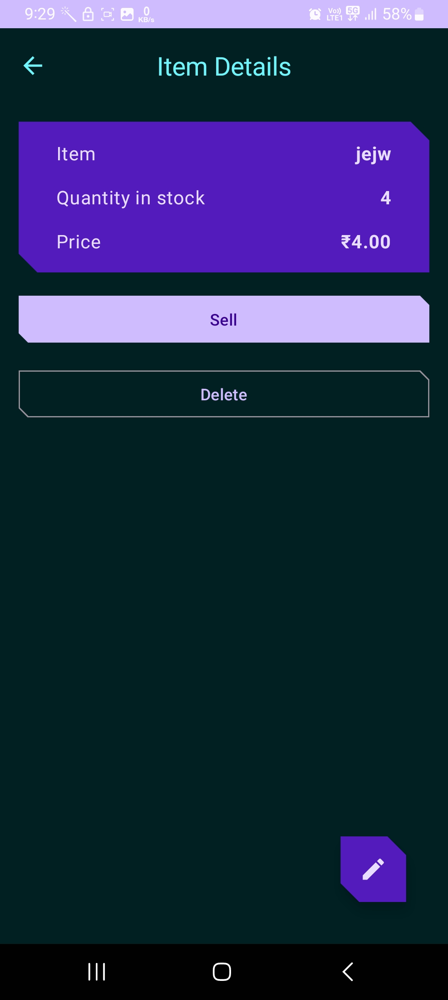
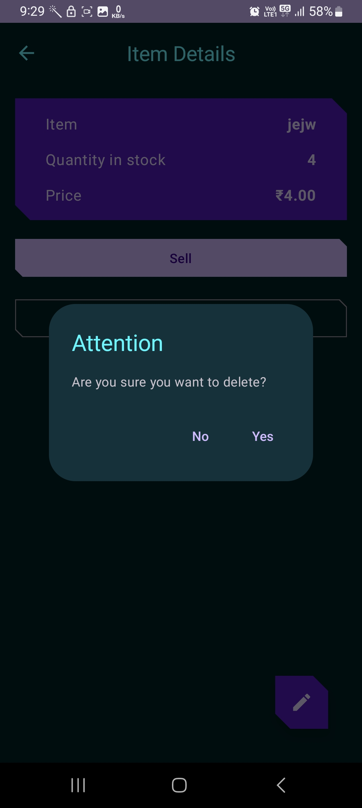

Inventory app 🛒
==================================

🚀 Introduction
------------

This app is an Inventory tracking app. Add, update, sell, and delete items from the local database.
This app demonstrated the use of the Android Jetpack component [Room](https://developer.android.com/training/data-storage/room) database.
The app also leverages [ViewModel](https://developer.android.com/topic/libraries/architecture/viewmodel),
[Flow](https://developer.android.com/kotlin/flow),
and [Navigation](https://developer.android.com/topic/libraries/architecture/navigation/).

🚀 Screenshots
------------

🚀 Pre-requisites
--------------

You need to know:
- How to create and use composables.
- How to navigate between composables, and pass data between them.
- How to use architecture components including ViewModel, Flow, StateFlow and StateUi.
- How to use coroutines for long-running tasks.
- SQLite database and the SQLite query language

🚀 Getting Started
---------------

1. Download and run the app.
